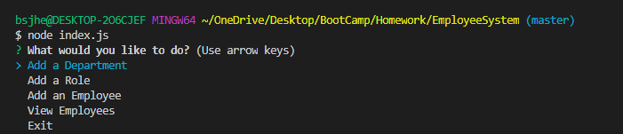
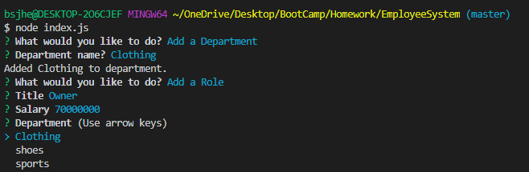
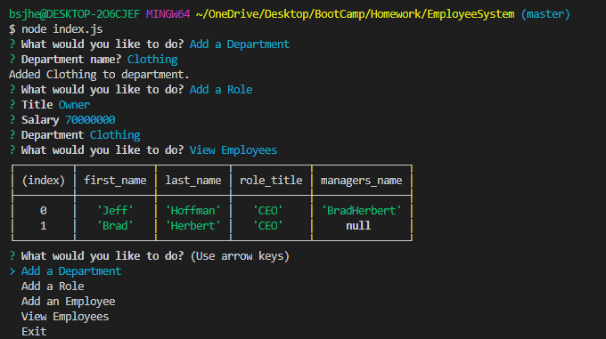

# EmployeeSystem

## User Story
    As a user, I want to track the employees for my company so that I can find their information easier.

## Visuals

  

	
### Photo Descriptions

    The user is prompted with an initial question of "What would you like to do?" They can select between Department, Role, Employee or choose to View Employees or Exit.

    If the user selects "Department" they are then prompted to input what department they want.

    If the user selects "Role" they are propted with the "title" of that role and the "salary" for that role.

    If the user selects Add an Employee they are prompted to input the employee name they would like to add. 

    If the user selects "View Employees" they are able to view all employees in the data base that have been added.

    If the user selects "Exit" it takes them back to the main menu.
    
## Usage
    Users looking for an app that will track their employees by mulitple fields including: first name, last name, title, or department. 
   
## Links 

[Employee Tracker](https://hidden-waters-67012.herokuapp.com/)